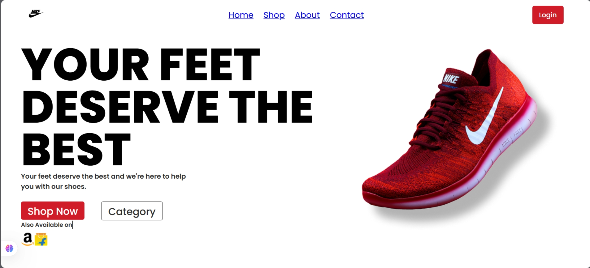

 Shoe Brand Landing Page

A simple and responsive shoe brand landing page built with *React* and *CSS*.  
It showcases a clean layout with brand logo, navigation bar, promotional text, product image, and shopping links.

🚀 Features
- Responsive layout
- Navigation bar with logo
- Hero section with catchy text and product image
- "Shop Now" and "Category" buttons
- Links for Amazon and Flipkart availability
- Styled entirely using CSS

 🛠 Tech Stack
- *React* (Vite or Create React App)
- *CSS3* for styling

 📂 Project Structure
project-folder/ 
├── src/ │   
├── assets/       # Images and icons │   
├── components/   # Navbar, Hero, etc. │   ├── App.jsx │   ├── index.jsx ├── public/ │   ├── index.html ├── package.json ├── README.md

## 📷 Preview


## 📦 Installation & Setup
1. Clone the repository:
   ```bash
   git clone https://github.com/Namira2/Brand-page.git

2. Navigate into the project folder:
cd you Brand-page
3. Install dependencies:
npm install
4. Start the development server:
